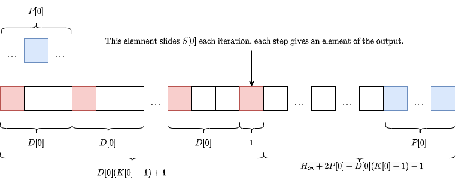

# Homework 2

## Convolutional Neural Networks

**a. Given an input image of dimension $10\times 11$, what will be output dimension after applying a convolution with $3\times 3$ kernel, stride of $2$, and no padding?**

Let's derive the formula for 1 dimension (for two dimensions is the same):

Let an input size of $H_{in}$ , a kernel size of $K[0]$ and a stride of $S[0]$. Initially, the kernel is overlapping with the first $K-1$ (starting at $0$) elements of the input, that gives the first element of the output, then we have:
$$
H_{out} = 1 + f(H_{in}, S[0], K[0]).
$$
Where $f$ is a function to be determined. The number of remaining elements to slide over are $H_{in}-K$ . However, if the sliding step (a.k.a. stride) is $S$ there are $\frac{H_{in}-K}{S}$ steps until the last element of the kernel overlaps the last element of the input, this way $f=\frac{H_{in}-K}{S}$:
$$
H_{out} = 1 + \frac{H_{in}-K[0]}{S[0]}.
$$
This expression works well when $H_{in}-K[0]$ is divisible by $S[0]$, but not otherwise. For example, let $H_{in}=5$, $S[0]=2$ and $K[0]=2$, then we got $H_{out}=2.5$, that makes no sense since $H_{out}$ must be an integer. The solution for this problem is to enclose the above formula by the $\text{floor}(\cdot)=\lfloor\cdot\rfloor$ function, giving the following expression:
$$
H_{out} = \left\lfloor\frac{H_{in}-K[0]}{S[0]}+1\right\rfloor
$$
Note that this expression have an important caveat, some elements of the input are not taken into account when  $H_{in}-K[0]$ is not divisible by $S[0]$, in the previous example $H[4]$ (the last element of $H_{in}$)  is not seen by the kernel. 

In the two dimensions case, just add and additional dimension:
$$
H_{out} = \left\lfloor\frac{H_{in}-K[0]}{S[0]}+1\right\rfloor\\
W_{out} = \left\lfloor\frac{W_{in}-K[1]}{S[1]}+1\right\rfloor
$$
Finally, the output shape is $5\times5$, but in the last column of the input is never seen by the kernel because $10-3$ is not divisible by $2$.

**b. Given an input of dimension $C\times H\times W$, what will be the dimension of the output of a convolutional layer with kernel of size $K\times K$, padding $P$, stride $S$, dilation $D$, and $F$ filters. Assume that $H \geq K$, $W \geq K$.**

From the above image, is easy to see that the last red element will make $$\left\lfloor\frac{H_{in}+2P[0]-D[0]\times (K[0]-1)-1}{S[0]}+1\right\rfloor$$ steps before getting to the last (blue) element. If the last step has available less than $S[0]$ elements, the step is not performed, the $\lfloor\cdot\rfloor$ is the mathematical way of expressing that. For the $W$ dimension is exactly the same and if $F$ filters are applied then the output will have $F$ channels, then:
$$
\begin{align}
& H_{out} = \left\lfloor\frac{H_{in}+2P[0]-D[0]\times (K[0]-1)-1}{S[0]}+1\right\rfloor \\
& W_{out} = \left\lfloor\frac{W_{in}+2P[1]-D[1]\times (K[1]-1)-1}{S[1]}+1\right\rfloor \\
& C_{out} = F
\end{align}
$$
**c) For this section, we are going to work with 1-dimensional convolutions. Discrete convolution of 1-dimensional input $x[n]$ and kernel $k[n]$ is defined as follows:**
$$
s[n]=(x\ast k)[n]=\sum_{m}x[n-m]k[m]
$$
**However, in machine learning convolution usually is implemented as a cross-correlation, which is defined as follows:**
$$
s[n]=(x\ast k)[n]=\sum_{m}x[n+m]k[m]
$$
**Note the difference in signs, which will get the network to learn an “flipped” kernel. In general it doesn’t change much, but it’s important to keep it in mind. In convolutional neural networks, the kernel k[n] is usually 0 everywhere, except a few values near $0: \forall_{|n|>M} k[n] = 0$. Then, the formula becomes:**
$$
s[n]=(x\ast k)[n]=\sum_{m=-M}^{M}x[n+m]k[m]
$$
**Let’s consider an input $x[n], x : \{1,2,3,4,5\} ∈ \mathbb{R}^2$ of dimension $5$, with $2$ channels, and a convolutional layer $f_W$ with one filter, with kernel size $3$, stride of $2$, no dilation, and no padding. The only parameters of the convolutional layer is the weight $W, W ∈ \mathbb{R}^{1\times 2\times 3}$, there’s no bias and no non-linearity.**

**(i) What is the dimension of the output $f_W(x)$? Provide an expression for the value of elements of the convolutional layer output $f_W (x)$. Example answer format here and in the following sub-problems: $f_W(x) \in \mathbb{R}^{42\times 42\times 42}, f_W(x)[i,j,k]=42$ .**

**(ii) What is the dimension of $\frac{\partial f_W(x)}{\partial W}$. Provide an expression for the values of the derivative $\frac{\partial f_W(x)}{\partial W}$.**

**(iii) What is the dimension of $\frac{\partial f_W(x)}{\partial x}$. Provide an expression for the values of the derivative $\frac{\partial f_W(x)}{\partial x}$.**

**(iv) Now, suppose you are given the gradient of the loss $\ell$ w. r. t. the output of the convolutional layer $f_W (x)$, i.e. $\frac{\partial\ell}{\partial f_W (x)}$. What is the dimension of $\frac{\partial\ell}{\partial W}$? Provide an expression for $\frac{\partial\ell}{\partial W}$. Explain similarities and differences of this expression and expression in (i).**
